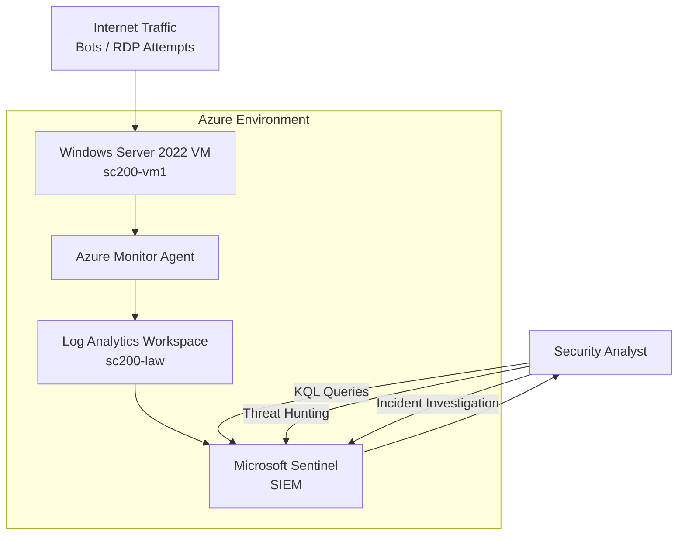

# Microsoft Sentinel SOC Lab (SC-200 Practice)

This project documents the creation of a **Security Operations Center (SOC) lab** using **Microsoft Azure**, **Log Analytics**, and **Microsoft Sentinel** to ingest and analyze Windows security logs from a virtual machine.

The lab simulates a real SOC environment where analysts collect, query, and investigate security events using **Kusto Query Language (KQL)**.

---

# SOC Lab Architecture



This diagram shows the security monitoring pipeline:

```
Internet → Virtual Machine → Azure Monitor Agent → Log Analytics → Microsoft Sentinel → SOC Analyst
```

---

# Technologies Used

- Azure Virtual Machines
- Windows Server 2022
- Azure Monitor Agent (AMA)
- Log Analytics Workspace
- Microsoft Sentinel
- Kusto Query Language (KQL)

---

# Lab Objectives

This lab demonstrates how to:

- Deploy a Windows server in Azure
- Configure a Log Analytics workspace
- Enable Microsoft Sentinel
- Connect Windows Security Events
- Collect and analyze security logs
- Use KQL for threat hunting
- Simulate SOC detection workflows

---

# Step 1 — Create a Resource Group

Navigate to:

```
Azure Portal
→ Resource Groups
→ Create
```

Configuration used:

| Setting | Value |
|------|------|
Resource Group | sc200-lab-rg |
Region | Central US |

---

# Step 2 — Create a Log Analytics Workspace

Navigate to:

```
Azure Portal
→ Create a Resource
→ Log Analytics Workspace
```

Configuration used:

| Setting | Value |
|------|------|
Workspace Name | sc200-law |
Region | Central US |
Resource Group | sc200-lab-rg |

After deployment completes, continue.

---

# Step 3 — Enable Microsoft Sentinel

Navigate to:

```
Azure Portal
→ Microsoft Sentinel
→ Create
```

Select the workspace created earlier:

```
sc200-law
```

Click **Add Microsoft Sentinel**.

Sentinel will now be attached to the workspace.

---

# Step 4 — Create a Windows Virtual Machine

Navigate to:

```
Azure Portal
→ Virtual Machines
→ Create
```

Configuration used:

| Setting | Value |
|------|------|
VM Name | sc200-vm1 |
Image | Windows Server 2022 Datacenter |
Size | Standard_D2s_v3 |
vCPUs | 2 |
RAM | 8 GB |
Region | Central US |
Inbound Ports | RDP (3389) |

Administrator credentials are created during deployment.

---

# Step 5 — Connect to the VM

Download the **RDP file** from Azure.

Open it using:

- Microsoft Remote Desktop (Mac)
- Remote Desktop Connection (Windows)

Login using the administrator credentials created during deployment.

---

# Step 6 — Configure Windows Security Event Connector

Navigate to:

```
Microsoft Sentinel
→ Data Connectors
→ Windows Security Events via AMA
```

Open the connector and configure:

```
Create Data Collection Rule
```

Configuration used:

| Setting | Value |
|------|------|
Rule Name | windows-security-events |
Target Resource | sc200-vm1 |
Events Collected | AllEvents |

Click **Create**.

---

# Step 7 — Verify Log Ingestion

Navigate to:

```
Microsoft Sentinel
→ Logs
```

Run the following query:

```kql
SecurityEvent
| take 20
```

If events appear in the results table, log ingestion is working correctly.

Expected event source:

```
Microsoft-Windows-Security-Auditing
```

---

# Step 8 — Detect Failed Login Attempts

Run the following query to identify brute force attempts:

```kql
SecurityEvent
| where EventID == 4625
| summarize FailedAttempts=count() by Account, Computer, IpAddress
| order by FailedAttempts desc
```

Event ID **4625** indicates a **failed logon attempt**.

---

# Step 9 — Identify Suspicious IP Addresses

The following query identifies the IP addresses generating the most failed logins:

```kql
SecurityEvent
| where EventID == 4625
| summarize Attempts=count() by IpAddress
| order by Attempts desc
```

Because RDP is exposed to the internet, automated bots frequently attempt authentication against the VM.  
This generates realistic security telemetry for analysis.

---

# Example Threat Hunting Query

This query detects suspicious process creation.

```kql
SecurityEvent
| where EventID == 4688
| project TimeGenerated, Account, Computer, Process, CommandLine
| order by TimeGenerated desc
```

---

# Common Windows Security Event IDs

| Event ID | Description |
|------|------|
4624 | Successful logon |
4625 | Failed logon |
4634 | Logoff |
4672 | Special privileges assigned |
4688 | Process created |
4776 | NTLM authentication |

---

# Cost Management

To avoid unnecessary charges:

```
Virtual Machines
→ Select sc200-vm1
→ Stop (Deallocate)
```

This stops compute billing while preserving the lab environment.

---

# Skills Practiced

- SIEM configuration
- Log ingestion
- Threat hunting
- Security event investigation
- KQL queries
- SOC workflow simulation

---

# Future Improvements

Possible extensions for the lab:

- Brute force detection analytics rule
- Automated incident response
- GeoIP attacker mapping
- Malware simulation
- Attack simulation using Atomic Red Team
- Sentinel dashboards

---

# Author

Javier Napoles  
Cybersecurity / SOC Analyst

Portfolio:

```
security.javiernapoles.com
```

---

# License

This project is for educational purposes.