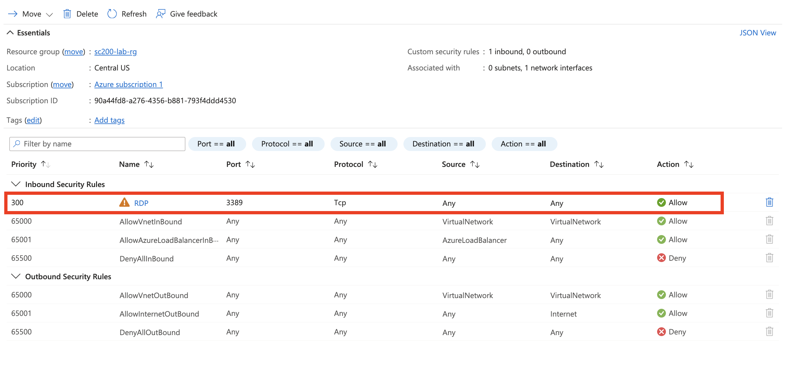
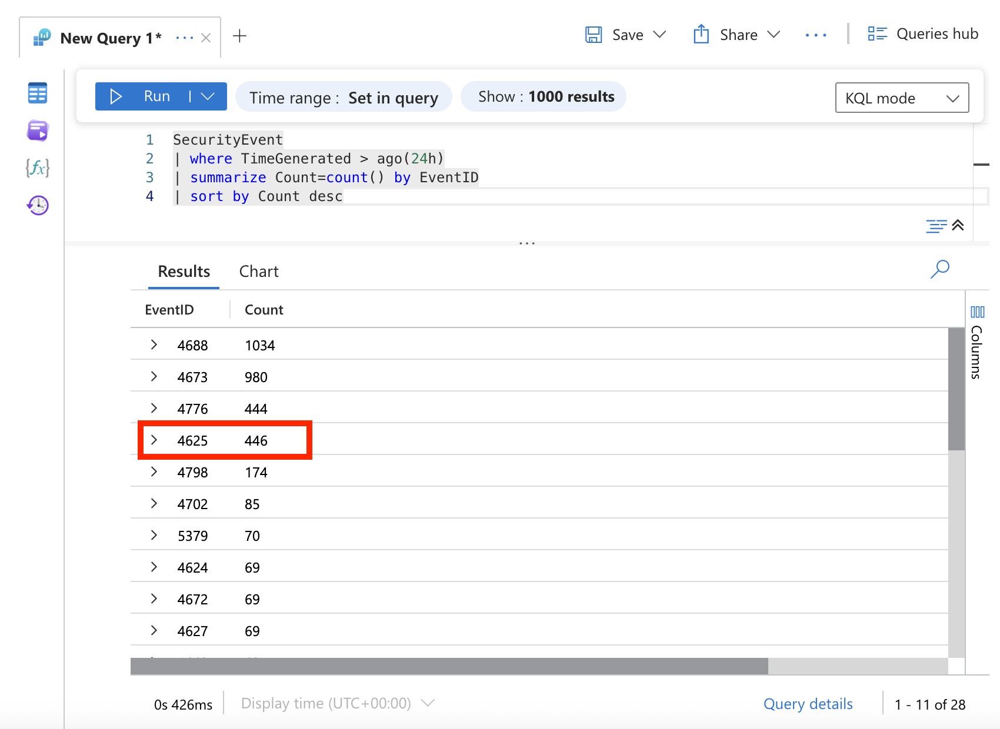
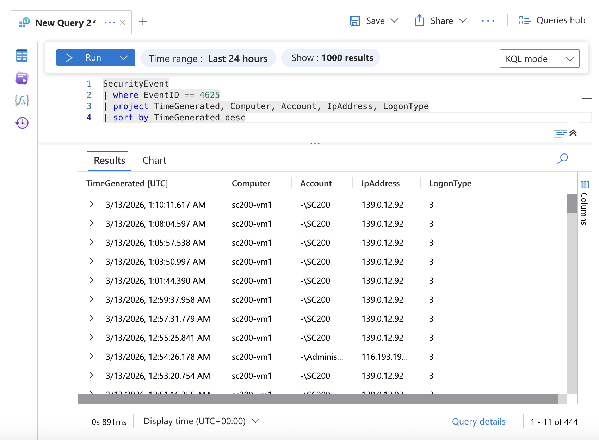
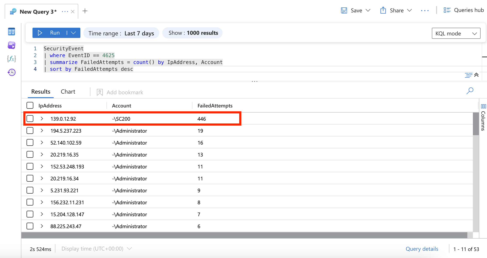
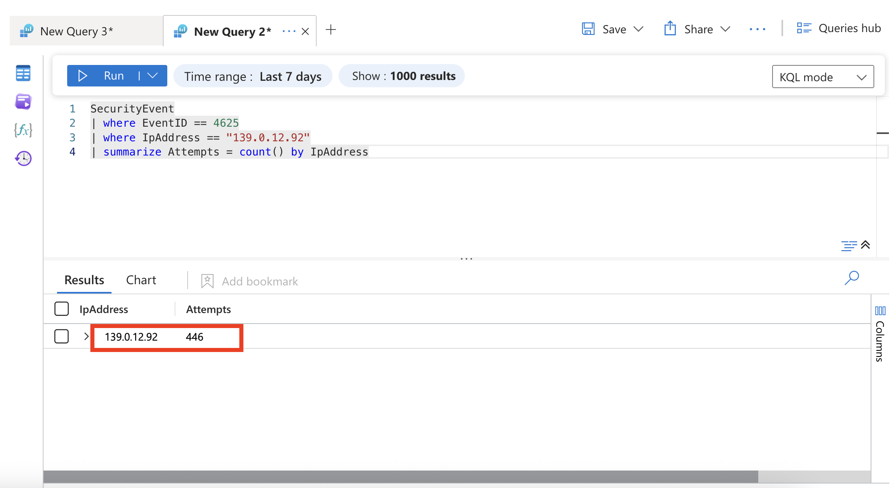
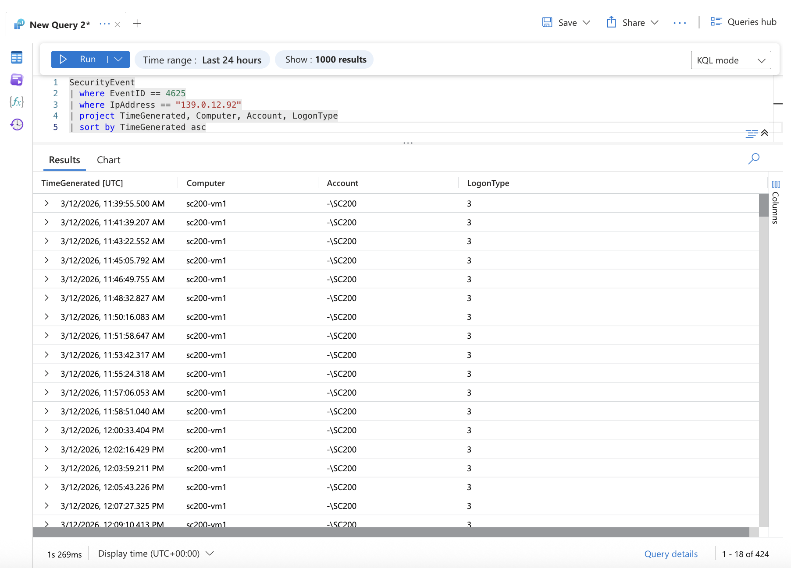
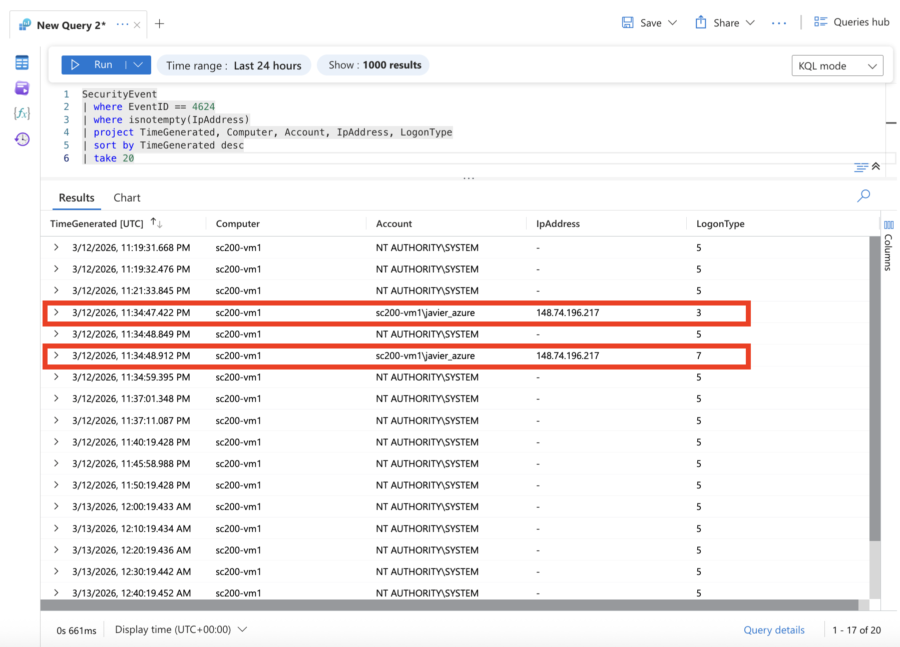
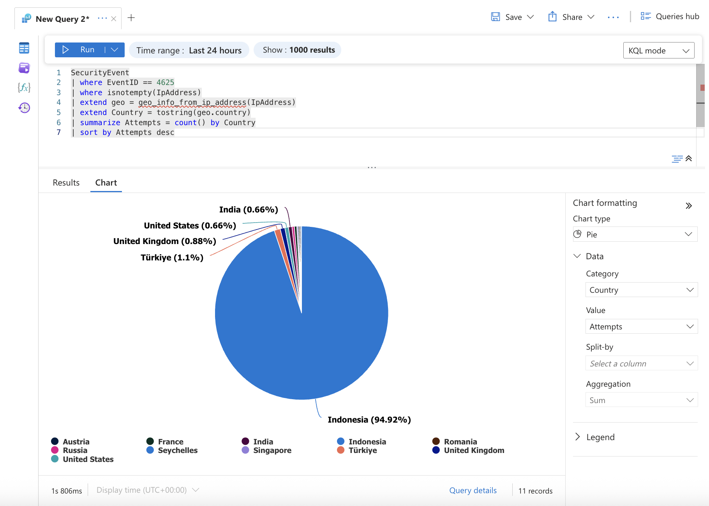

# Microsoft Sentinel Brute-Force Authentication Investigation

Author: Javier Napoles  
Focus: SOC Analyst / SC-200 Preparation  
Environment: Microsoft Azure Security Ecosystem  

---


## Overview

This investigation documents a simulated security incident analyzed using **Microsoft Sentinel**. The objective was to identify, investigate, and understand brute-force authentication attempts targeting an Azure virtual machine.

During the lab setup, the virtual machine was unintentionally exposed to the public internet via RDP. Shortly after deployment, the system began receiving real-world brute-force login attempts from multiple geographic locations.

This behavior was leveraged as a learning opportunity to analyze attacker activity using Microsoft Sentinel.

---

# Environment

Platform: Microsoft Azure  
SIEM: Microsoft Sentinel  
Log Source: Windows Security Events  
Virtual Machine: sc200-vm1  
Data Table: SecurityEvent  

---

## Infrastructure Exposure Analysis

During the investigation, it was identified that the virtual machine was publicly exposed to the internet.

The Network Security Group (NSG) associated with the VM contained the following inbound rule:

- Source: Any (0.0.0.0/0)
- Destination Port: 3389 (RDP)
- Protocol: TCP
- Action: Allow



This configuration allowed any external IP address to attempt remote access to the system.

As a result, the virtual machine became a target for automated brute-force attacks originating from multiple geographic locations.


# Incident Summary

During routine log analysis, multiple failed authentication attempts were detected against the virtual machine **sc200-vm1**.

Further investigation revealed:

- 446 failed login attempts
- originating from a single external IP address
- targeting the same user account
- occurring over a sustained period of time

The behavior strongly indicates an **automated credential brute-force attack**.

---

# Log Ingestion Validation

To confirm that Windows Security logs were properly ingested into Microsoft Sentinel, the following query was executed:

```kql
SecurityEvent
| where TimeGenerated > ago(24h)
| summarize Count=count() by EventID
| sort by Count desc
```

This query verifies that relevant security events are successfully being collected by Sentinel.



---

# Detection of Failed Authentication Attempts

Failed login attempts were identified using **EventID 4625**, which represents unsuccessful authentication events.

Query used:

```kql
SecurityEvent
| where EventID == 4625
| project TimeGenerated, Computer, Account, IpAddress, LogonType
| sort by TimeGenerated desc
```

The results revealed repeated authentication failures originating from external IP addresses.



---

# Identification of Attack Source

To determine which IP address generated the highest number of failed login attempts, the following query was executed:

```kql
SecurityEvent
| where EventID == 4625
| where isnotempty(IpAddress)
| summarize FailedAttempts = count() by IpAddress
| sort by FailedAttempts desc
| take 10
```

Results showed:

IP Address: **139.0.12.92**  
Failed Attempts: **446**

This indicates a clear brute-force attempt originating from a single external source.



---

# Brute Force Attempt Volume

To confirm the scale of the attack originating from the identified IP address, the following query was executed:

```kql
SecurityEvent
| where EventID == 4625
| where IpAddress == "139.0.12.92"
| summarize Attempts = count() by IpAddress
```

Results showed:

IP Address: **139.0.12.92**  
Failed Attempts: **446**

This confirms a high-volume brute-force attempt.



---

# Attack Timeline Analysis

To analyze the progression of the attack, authentication attempts from the identified IP address were ordered chronologically.

Query used:

```kql
SecurityEvent
| where EventID == 4625
| where IpAddress == "139.0.12.92"
| project TimeGenerated, Computer, Account, LogonType
| sort by TimeGenerated asc
```

The results show repeated login attempts over time targeting the same system and account.

The frequency of attempts suggests the use of an automated password guessing tool.



---

# Verification of Successful Logins

To determine whether the attacker successfully authenticated, successful login events (**EventID 4624**) were analyzed.

Query used:

```kql
SecurityEvent
| where EventID == 4624
| where isnotempty(IpAddress)
| project TimeGenerated, Computer, Account, IpAddress, LogonType
| sort by TimeGenerated desc
| take 20
```

Analysis confirmed that **no successful authentication events originated from the attacking IP address**.

This indicates that the brute-force attack was unsuccessful.



---

# Geographic Distribution of Attack Sources

To understand the geographic origin of failed authentication attempts, IP addresses were enriched using Sentinel's GeoIP lookup.

Query used:

```kql
SecurityEvent
| where EventID == 4625
| where isnotempty(IpAddress)
| extend geo = geo_info_from_ip_address(IpAddress)
| extend Country = tostring(geo.country)
| summarize Attempts = count() by Country
| sort by Attempts desc
```

The results were visualized using a **pie chart** to illustrate the geographic distribution of attack sources.

Most attempts originated from **Indonesia**, with smaller numbers from several other countries.



---

# Findings

The investigation identified a high-volume brute-force authentication attempt targeting the Azure virtual machine **sc200-vm1**.

Key observations:

- 446 failed authentication attempts
- Attack originating from IP **139.0.12.92**
- Repeated login attempts targeting the same account
- Attack behavior consistent with automated brute-force activity
- No successful authentication detected

---

# Conclusion

The analysis confirms that the system was targeted by a **credential brute-force attack**.

Despite the high number of authentication attempts, the attack **did not succeed**.

This investigation demonstrates how **Microsoft Sentinel can be used to detect, analyze, and investigate authentication-based attacks in real time.**

---

# Recommended Mitigations

To reduce the risk of future brute-force attacks:

- Implement account lockout policies
- Restrict public RDP access using Azure NSG rules
- Enable Multi-Factor Authentication (MFA)
- Configure Sentinel analytics rules for brute-force detection
- Continuously monitor authentication logs

---

# MITRE ATT&CK Mapping

Technique: **T1110 — Brute Force**

Description:  
Attackers attempt to gain access by systematically guessing passwords through repeated authentication attempts.

---

End of Document