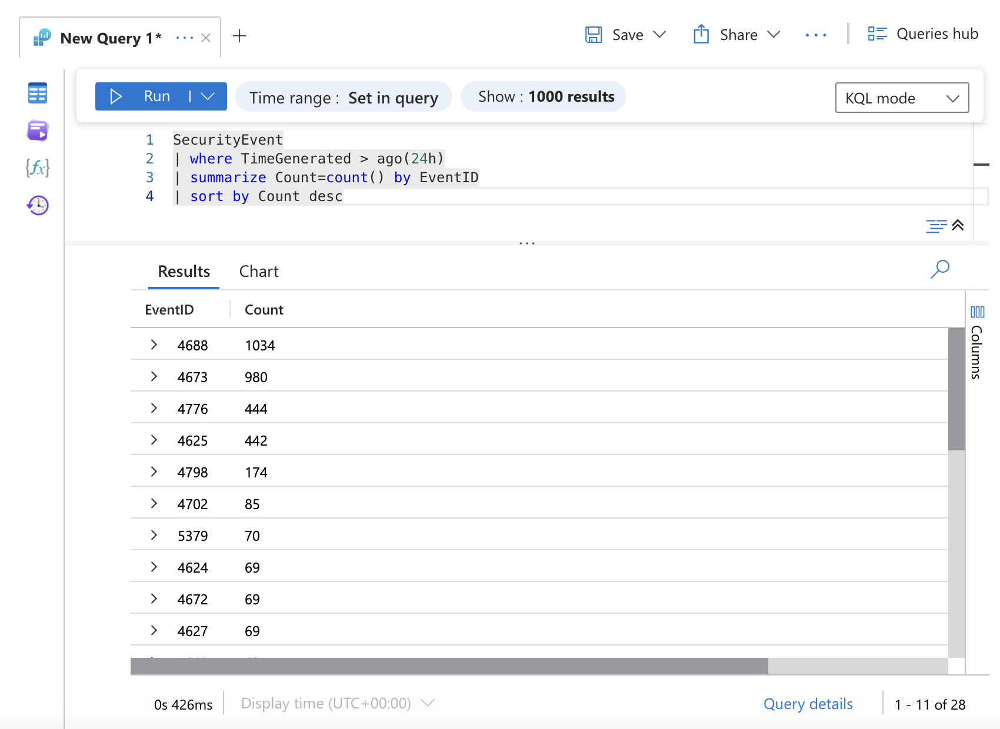

## Log Ingestion Verification

Before starting the investigation, it was necessary to confirm that Windows Security logs were successfully being ingested into Microsoft Sentinel.

To validate log ingestion, the following KQL query was executed:

```kql
SecurityEvent
| where TimeGenerated > ago(24h)
| summarize Count=count() by EventID
| sort by Count desc
```

This query summarizes all Event IDs collected in the last 24 hours.

The results confirmed that multiple Windows Security events were successfully ingested into Sentinel, including:

- EventID 4624 — Successful logon
- EventID 4625 — Failed logon
- EventID 4688 — Process creation
- EventID 4673 — Privileged service call

This verifies that the Azure VM is properly sending security logs to the SIEM, allowing further investigation and detection activities.

<p align="center">

</p>